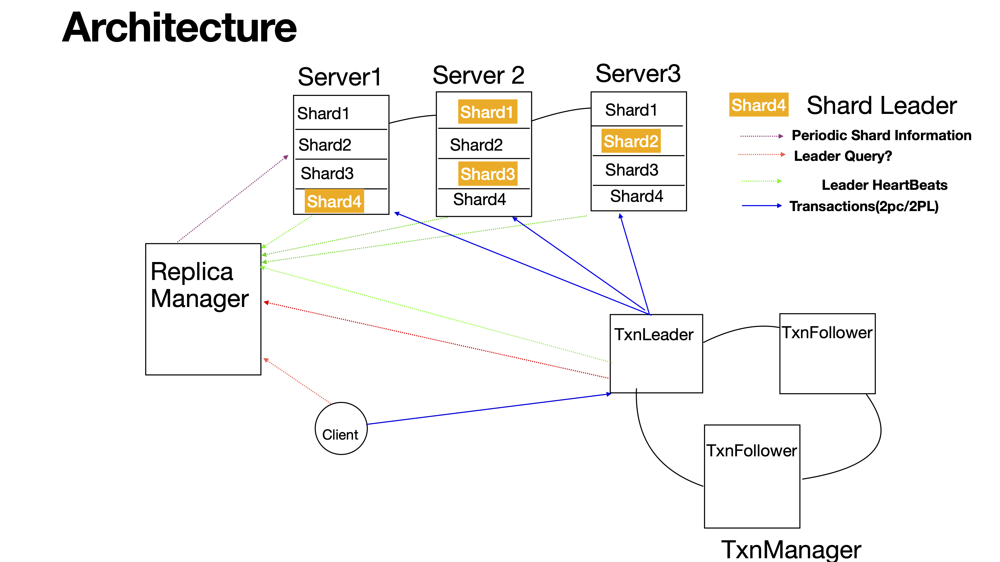

#ACID KV Store

#ARCHITECTURE

## ReplicaMgr

./replicamgr --id 1 --cluster http://127.0.0.1:12379 --servers 127.0.0.1:22379,127.0.0.1:22380,127.0.0.1:22381 --grpcport 127.0.0.1:21224 --httport 1026 --shards 3

## KVstore

./store --grpcport  127.0.0.1:22379 --httpport 1024
./store  --grpcport 127.0.0.1:22381 --httpport 1027
./store  --grpcport 127.0.0.1:22381 --httpport 1025

## TxStore

./tx --id 2   --cluster http://127.0.0.1:23479 --cliport 23480 --grpcport 127.0.0.1:20051 --replicamgrs 127.0.0.1:21224

## How to run GoTest Cases

TestBatchMultipleConcurrentReadTxnMultiOpDifferentScale
TestMultipleConcurrentReadTxnMultiOpDifferentScale
TestBatchMultipleConcurrentWriteTxnMultiOpDifferentScale
TestReadLatency
TestWriteLatency
TestMultipleConcurrentWriteTxnMultiOpDifferentScale
TestMultipleConcurrentReadTxnDifferentScale
TestMultipleConcurrentWriteTxnDifferentScale
TestMultipleConcurrentWriteTxnDifferentKey
TestSimpleReadMultiOpTxn
TestSimpleBatchWriteMultiOpTxn
TestSimpleWriteMultiOpTxn
TestSimpleWriteTxn
TestSimpleReadWriteTxn
TestSimpleReadTxn

go test -run  TestMultipleConcurrentWriteTxnDifferentKeyScale -v
go test -run TestMultipleConcurrentReadTxnDifferentScale -v
go test -list . 

## Query Commands use curl or via browser

Replmgr:   http://<replmgrip:replport>/api/replica

Txmgr:     http://<txmgrip:txmgrhttp>/api/txmgrquery

Kvstore:   http://<kvstoreip:kvhttpport>/api/replicaconfig/

Query Key in kvstore: http://<kvstoreip:kvhttpport>/api/key/890

## AWS Commands:

./replicamgr --id 1 --cluster http://127.0.0.1:12379 --servers 3.101.19.215:10000,54.183.239.204:10000,18.144.7.44:10000 --grpcport 13.57.212.138:21224 --httport 16500 --shards 3

./store --grpcport 3.101.19.215:10000 --httpport 15001

./store --grpcport 54.183.239.204:10000 --httpport 15001

./store --grpcport 18.144.7.44:10000 --httpport 15001

./tx --id 1 --cluster http://127.0.0.1:23401,http://127.0.0.1:23402,http://127.0.0.1:23403 --cliport 23480 --grpcport 52.53.235.222:20051 --replicamgrs 13.57.212.138:21224

./tx --id 2 --cluster http://127.0.0.1:23401,http://127.0.0.1:23402,http://127.0.0.1:23403 --cliport 23480 --grpcport 54.177.222.139:20051 --replicamgrs 13.57.212.138:21224

./tx --id 3 --cluster http://127.0.0.1:23401,http://127.0.0.1:23402,http://127.0.0.1:23403 --cliport 23480 --grpcport 54.177.137.148:20051 --replicamgrs 13.57.212.138:21224
